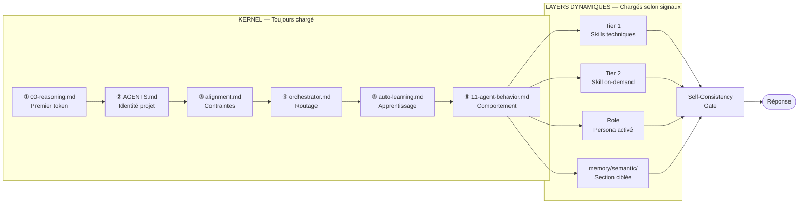

# Boot Sequence — Séquence de démarrage déterministe

> La séquence de boot n'est pas une convention — c'est un mécanisme de contrôle du contexte. L'ordre d'injection des fichiers dans la fenêtre contextuelle détermine l'importance relative que le modèle leur accordera.

---

## Le problème que la séquence résout

Les LLMs ne traitent pas les instructions de manière uniforme selon leur position dans le contexte. Liu et al. (2023) démontrent une **courbe de performance en U** : les informations placées au début et à la fin d'un contexte long sont mieux retenues que celles placées au milieu. Dans un contexte de 100k tokens, une instruction critique placée au milieu sera statistiquement moins influente qu'une instruction banale placée au début.

La séquence de boot exploite ce phénomène délibérément : **les composants les plus critiques sont chargés en premier**, bénéficiant du biais de primauté (*primacy bias*).

---

## Séquence canonique

```
Position 1 — 00-reasoning.md         ← Primacy bias maximal
Position 2 — AGENTS.md               ← Identité et structure du projet
Position 3 — alignment.md            ← Contraintes constitutionnelles
Position 4 — orchestrator.md         ← Moteur de routage
Position 5 — auto-learning.md        ← Protocole d'apprentissage
Position 6 — 11-agent-behavior.md    ← Comportement et communication
Position 7+ — Tier 1 Skills          ← Chargés si tâche technique
Position N  — Tier 2 / Role / Sections mémoire  ← Chargés selon signaux
```

---

## Diagramme de flux



---

## Justification de chaque position

### Position 1 — `00-reasoning.md`

Le protocole de raisonnement structuré doit être le premier token parce qu'il **cadre l'ensemble du traitement qui suit**. Si le modèle commence à répondre avant d'avoir activé son protocole de raisonnement, la réponse est déjà partiellement construite sans ce filtre. Le placer en premier garantit que chaque décision dans la réponse passe par le bloc `<reasoning>`.

C'est aussi la seule protection contre les réponses réflexes — les réponses que le modèle produit "d'instinct" à partir des patterns les plus fréquents dans son pré-entraînement, sans passer par un raisonnement délibératif.

### Position 2 — `AGENTS.md`

L'identité du projet (stack, architecture, repository map) doit être établie immédiatement après le protocole de raisonnement, avant que les contraintes et les skills soient chargés. Ainsi, quand `alignment.md` sera traité, le modèle sait déjà dans quel projet il opère — les contraintes s'appliquent à un contexte spécifique, pas dans l'abstrait.

### Position 3 — `alignment.md`

Les contraintes constitutionnelles doivent précéder les skills et les rôles pour une raison architecturale : **les skills et les rôles ne peuvent pas contredire alignment**. Si alignment est chargé après un rôle, un conflit peut se produire sans résolution claire. En chargeant alignment en premier, on établit la hiérarchie de vérité avant d'introduire les couches qui seront contraintes par elle.

### Position 4 — `orchestrator.md`

L'orchestrateur doit être chargé avant les skills pour pouvoir les router. Si des skills sont chargés avant l'orchestrateur, ils sont dans le contexte sans mécanisme de sélection — le modèle les traite comme également pertinents, ce qui dilue leur effet.

### Position 5 — `auto-learning.md`

Le protocole d'apprentissage doit être actif avant l'exécution pour que le modèle sache, pendant la tâche, quels événements méritent d'être capturés en mémoire. Un protocole chargé après-coup est consultatif — un protocole chargé en amont est structurant.

### Position 6 — `11-agent-behavior.md`

Les règles de comportement ferment le kernel. À ce stade, le modèle connaît : le protocole de raisonnement, l'identité du projet, les contraintes, le mécanisme de routage, et le protocole d'apprentissage. Les règles de comportement opérationnalisent tout ce contexte en comportements concrets.

---

## Ce qui invalide la séquence

| Violation | Conséquence |
|---|---|
| Charger un Tier 1 Skill avant `alignment.md` | Le skill opère sans contrainte — peut produire du code qui viole les standards de sécurité sans le détecter |
| Omettre `00-reasoning.md` | Aucun protocole de raisonnement actif — réponses réflexes, non-auditables |
| Charger `AGENTS.md` après les contraintes | Les contraintes s'appliquent dans un vide — pas ancré dans le contexte projet |
| Inverser l'ordre Tier 1 / Tier 2 | Le Tier 2 (on-demand) peut occuper une position de primauté qu'il ne devrait pas avoir |

---

## Non-invariants intentionnels

La séquence ne prescrit pas l'ordre des fichiers **au sein d'un même tier**. Dans Tier 1, par exemple, un skill de sécurité et un skill TypeScript peuvent être chargés dans n'importe quel ordre — ils sont fonctionnellement indépendants. L'ordre canonique ne s'applique qu'entre les tiers et entre le kernel et les layers dynamiques.


---

**Navigation** — [← 01 — Système](./README.md) · [↑ Index](../README.md) · [Context Layers →](./context-layers.md)
