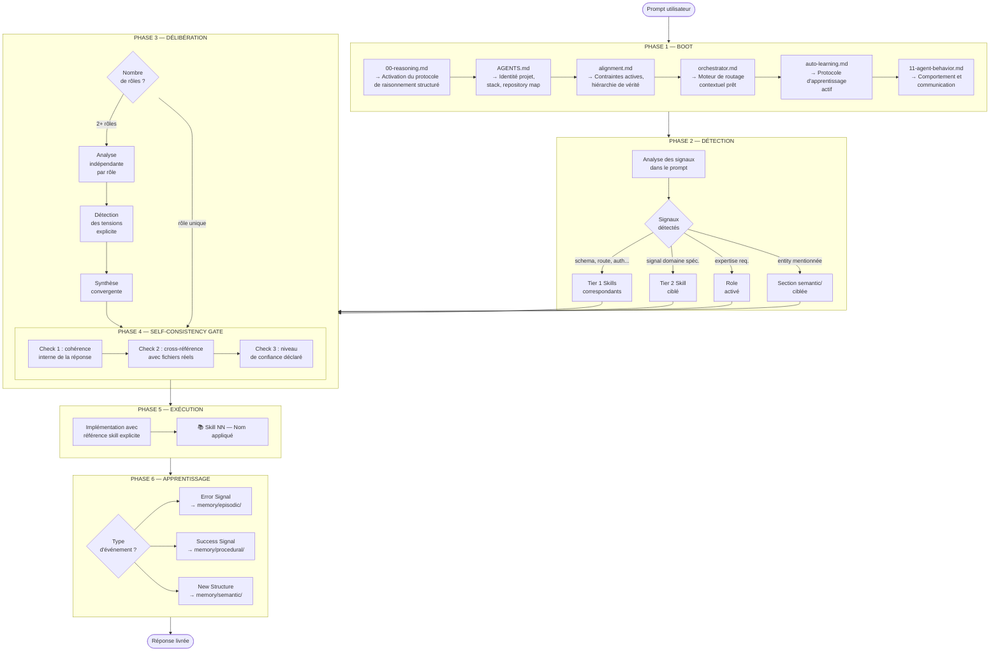

# Session Flow — Flux complet d'une session

> Du prompt à la réponse : ce qui se passe à chaque étape, pourquoi, et ce qui garantit la qualité du résultat.

---

## Vue d'ensemble



---

## Phase 1 — Boot

La séquence de boot est **déterministe et non-interruptible**. L'ordre exact est prescrit et justifié dans [boot-sequence.md](./boot-sequence.md). Aucun élément des layers dynamiques n'est chargé avant la fin du boot.

---

## Phase 2 — Détection

L'orchestrateur scanne le prompt pour des **signaux** — mots-clés ou patterns qui indiquent le domaine de la tâche. Ces signaux sont mappés dans la Task Detection Table de `AGENTS.md`.

La détection produit une liste de ressources à charger. La règle de priorité est :
```
section ciblée > fichier complet > résumé d'index
```

Un signal absent de la table = ressource non chargée. Ce n'est pas une erreur — c'est le comportement attendu. Le modèle opère avec les skills génériques du kernel.

---

## Phase 3 — Délibération

Activée uniquement si 2+ rôles sont nécessaires simultanément. Le protocole MoA (Wang 2024) garantit que les tensions entre perspectives sont **surfacées explicitement** plutôt que résolues silencieusement par le modèle.

Format de délibération :
```markdown
[role-a]: "From [domain A], le problème est X, le risque est Y"
[role-b]: "From [domain B], la contrainte est Z"
⚠️ TENSION : [role-a] suggère A, [role-b] requiert B
Résolution : B gagne — Security > Performance (alignment.md)
Synthèse : [implémentation qui satisfait les deux contraintes]
```

---

## Phase 4 — Self-Consistency Gate

Avant toute finalisation, 3 vérifications mandatory :

**Check 1 — Cohérence interne**
- La réponse se contredit-elle ?
- Les types TypeScript sont-ils cohérents entre les fichiers ?
- Les imports référencent-ils des exports qui existent ?

**Check 2 — Cross-référence**
- Chaque assertion sur le code a-t-elle été vérifiée dans un fichier réel ?
- Le pattern proposé est-il cohérent avec les patterns existants dans `memory/semantic/` ?

**Check 3 — Confiance déclarée**
```
CERTAIN  → vu dans un fichier réel
PROBABLE → inféré de la structure, non vérifié
INCERTAIN → non vérifié — recommander la vérification explicite
```

---

## Phase 5 — Exécution

L'implémentation doit référencer explicitement le skill appliqué : `📚 Skill NN — Nom`. Si aucun skill n'est applicable, déclarer : `🔴 SKILL GAP — aucun skill couvre ce cas. Créer .agent/rules/tier-1/XX-[domaine].md`.

---

## Phase 6 — Apprentissage

Après chaque session significative, le protocole Verbal RL (Shinn 2023) décide quoi capturer en mémoire. Le scoring de confiance détermine le type d'entrée :

```
Confidence < 0.6  → NOTE (provisional)
Confidence 0.6–0.8 → PATTERN (avec tag de prudence)
Confidence > 0.8  → RULE (intégrée comme règle ferme)
```

La règle critique : **une observation unique ne devient jamais une RULE directement**. Même avec une confiance de 0.9, si elle n'a été observée qu'une fois, elle reste PATTERN.


---

**Navigation** — [← Context Layers](./context-layers.md) · [↑ Index](../README.md) · [Context Budget →](./context-budget.md)
